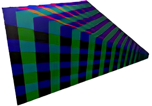

For the past 2 months, during my studies at [Breda University of Applied Sciences](https://www.buas.nl) as a year 2 programming student, I have been working on a Clustered Renderer for the PlayStation 5, with the aim to learn more about rendering techinques and PlayStation's AGC API. Throughout this blog post I will share my findings about my research and implementation of the Clustered Shading algorithm. Unfortuantely I can't share the source code of my project because AGC is a closed source API under an NDA. Even though that's the case, I will share some pseudo code relevant to the subject. So let's get to it!

## Table of contents
1. [Theory](#theory)
    1. [What is Clustered Shading?](#theory1)
    2. [Comparing rendering algorithms](#theory2)
2. [Implementation](#implementation)
    1. [Building clusters](#implementation1)
    2. [Culling clusters](#implementation2)
    3. [Compacting clusters](#implementation3)
    4. [Light assignment](#implementation4)
3. [Conclusion](#conclusion)
    1. [Further reading](#conclusion1)
    2. [Credits](#conclusion2)

## Theory <a name="theory"></a>

*Rendering thousands of dynamic lights in real-time... Optimizizing as much as possible... Squeezing as much performance as possible from the hardware...*

The Real-Time rendering field has been striving to improve image quality for decades. Modern rendering engines are capable of rendering beautiful scenes. One reason for that is the increase of computational power of our hardware. But without software optimization it wouldn't be possible to render such images quickly.

There are countless of optimizations one could implement. However now we will be focusing on optimization techniques that lower the number of lighting computation during shading. There are a few notable techniques that have been used in Real-Time renderers and had dramatic impact on performance optimization. We will be closely looking at one of them, clustered shading.


### What is Clustered Shading? <a name="theory1"></a>

The Clustered Shading algorithm is based off of [1] [Tiled Shading, researched by Ola Olsson and Ulf Assarsson](https://www.cse.chalmers.se/~uffe/tiled_shading_preprint.pdf). The Tiled Shading algorithm efficiently culls lights for both forward and deffered systems. The idea is that we subdivide the screen into tiles and build a buffer which keeps track of what lights affects the geometry within a given tile. During the shading pass we compute only the lights within the current tile. This significantly reduces the number of lights that we need to compute for. [3] [Ángel Ortiz, who also made a blog post about clustered shading, created great visualizations for Tiled and Clustered Shading, which I have used. Check out his blog post as well!](https://www.aortiz.me/2018/12/21/CG.html) Here is a visualization of assigning lights into tiles:


// TODO: Point out issues with Tiled Shading

In [2] [*Clustered Shading (*Ola Olsson, Markus Billeter and Ulf Assasson, Clustered Deferred and Forward Shading, 2012*)*](https://www.cse.chalmers.se/~uffe/clustered_shading_preprint.pdf) we take things further and also subdivide the screen into the 3rd dimension, using 3D cells, also known as clusters. This is an obvious next step based on the issues pointed out before. Here is a visualization of assigning lights into said clusters from a top-down view:


In the Tiled Shading visualization you can see that lights effects all the meshes in the depth. For example the red light, even though it is close to the camera, it also is being accounted for the mesh all the way in the back. In the Clustered Shading visualization you can see that we don't have that issue anymore.

There are number of great benefits about using this rendering technique. You can choose to take the forward rendering or deffered rendering path. We have also changed the classic forward/deffered algorithmic complexity from `O(light * mesh)` to `O(light + mesh)`, since with clustered shading we only perform shading using relevant lights per mesh. There are a few more benefits which I will discuss in the next section.

### Comparing rendering algorithms <a name="theory2"></a>

// TODO


## Implementation <a name="implementation"></a>

At the center the Clustered Shading algorithm creates data structures which subdivide the view frustum into clusters and then assigns lights to those clusters. [2] [The original algorithm of Clustered Shading](https://www.cse.chalmers.se/~uffe/clustered_shading_preprint.pdf) from has 5 steps to it:

1. Building clusters
2. Render scene to G-Buffers or Z-Prepass
3. Culling clusters
4. Assigning lights to clusters
5. Shading samples

I will go step by step and explain how I implemented every step of the algorithm. I have split up the Culling Clusters step into 2, finding visible clusters (culling clusters) and compacting clusters. I also won't cover steps 2 and 5, because those steps depend on the shading model you are using.

The implementation you will be seeing throughout this section is written in compute shaders. Although the Clustered Shading algorithm can be fully implemented on the CPU, I chose to do it on the GPU. With the foreword out of the way, let's begin!


### Building clusters <a name="implementation1"></a>

To create the clusters we will be using the same way the tile are created for Tiled Shading. We will add to that by subdividing the tiles along the depth axis. We will also store the samples in view space, instead of screen space. This prevents depth discontinuities and performence issues when pixels are moving. First we will look at subdividing the depth to achieve 3D tiles, in other words clusters.

#### Subdividing depth

[2] [The original Clustered Shading paper](https://www.cse.chalmers.se/~uffe/clustered_shading_preprint.pdf) showed 3 subdivision schemes. The first way of subdividing depth the paper described is to do it in normalized device coordinates into a set of uniform segments. However, because of non-linearity of NDC, this subdivision results in uneven cluster dimensions. Which means clusters close to the camera become very thin and those far away very long. We would generally like for the clusters to not have too many lights and for them to be evenly distributed to achieve best results.


The next subdivision the paper showed is uniform subdivision in view space. But this actually produces the opposite artifact, where clusters near the camera are long and narrow and those far away are wide and flat.


The third subdivision of the paper was an exponential subdivision in view space, which the paper settled on. By spacing the divisions exponentially, we achieve self-similar subdivisions, such that the clusters become as cubical as possible. Which works nicely when representing clusters as AABB's and gets rid of the problems the previous 2 approches had.



But in the end I decided to use another subdivision scheme. When researching this topic I came across how [4] [Doom 2016](https://advances.realtimerendering.com/s2016/Siggraph2016_idTech6.pdf) has done depth subdivision for their clusters:

$$
𝑍𝑆𝑙𝑖𝑐𝑒 = 𝑁𝑒𝑎𝑟Z × (𝐹𝑎𝑟Z / 𝑁𝑒𝑎𝑟Z)^{𝑠𝑙𝑖𝑐𝑒 / 𝑛𝑢𝑚 S𝑙𝑖𝑐𝑒s}
$$

Here "𝑍" represents the depth, "𝑁𝑒𝑎𝑟" and "𝐹𝑎𝑟" represent the near and far planes. Unfortunately I don't have a nice way of showing this subdivision for now, but the formula is simple enough to be able to visualize it.

This subdivision is easier to calculate than the 3rd approach when creating clusters. But also another major advantage of this equation is revealed when you solve it for the slice:

$$
𝑆𝑙𝑖𝑐𝑒 = log(Z) × {𝑛𝑢𝑚 S𝑙𝑖𝑐𝑒s \over log(FarZ / 𝑁𝑒𝑎𝑟Z)} - {num Slices × log(NearZ) \over log(FarZ / NearZ)}
$$

The advantage here is that, when we want to get the slice using depth, we use the equation above, which aside from "log(Z)" is a constant and can be pre-calculated. This means we can get the slice using only a log, a multiplication and an addition operation.

#### Chosing the shape of the clusters

Now that we have chosen our subdivision scheme, it's time to look at what shape our clusters should be. Ideally the shape should be as simple as possible while encompassing the whole cluster, since we need to assign lights to clusters by doing a collision check between the light and the clusers. Also we have to keep it compact so it doesn't eat up too much bandwidth.

The easy solution would be to use Axis Aligned Bounding Boxes (AABBs). We can represent such a shape with only 2 float3's, a min and max point, which makes this solution good regarding bandwidth. In this case, in order to assign lights to clusters, we need to check collision between a cube and a sphere, which also keeps the algorithm pretty simple. But there is an issue with using AABBs.


 When we visualize the clusters in 2D, we can see that the AABBs need to overlap to cover the whole cluster. This makes AABBs not that accurate and leads to lights being assigned to clusters that don't need to be assigned to and clusters not being culled away while there is no need for them. That means that more pixels can potentially take into account lights that don't contribute to the pixel's final color.

 This issue can be solved by using planes to represent the clusters, which [4] [Doom 2016](https://advances.realtimerendering.com/s2016/Siggraph2016_idTech6.pdf) did. We can use 4 planes to represent 1 cluster, where a plane in code is made out of a float3 normal and a float disance to origin. This would make a cluster take up a bit more memory. In total 16 floats, instead of 6 float when using AABB's. *In actuality you also need a near and far distances for each cluster when doing the light assignment step for checking collisions, which would add another 2 floats, but those can be computed dynamically from the 4 planes we are storing.* Such clusters would look like this:


You can see the overlap is gone, but you need to store more memory. Both cluster creation and the light assignment steps also become more complicated, since you have to check collisions with clusters based on their planes.

In the end I have chosen to use AABBs as my cluster shape. Because of the time constraints I had for this project I unfortunately couldn't implement plane based clusters as well.

#### Implementation of cluster creation

Now that we have both chosen the depth subdivision and our cluster shape, we can get to writing our compute shader code for cluster generation. Due to the size of the code I have removed some parts, but the most important concepts are still there:

```glsl
void main(uvec3 thread_id)
{
    uint cluster_index = thread_id.x +
                         thread_id.y * num_clusters_x +
                         thread_id.z * (num_clusters_x * num_clusters_y);
                         
    // Calculate the min and max point in screen space
    vec4 min_point_ss = vec4(thread_id.xy * tile_size, 1.0f, 1.0f); // Bottom left
    vec4 max_point_ss = vec4(vec2(thread_id.xy + 1) * tile_size, 1.0f, 1.0f); // Top Right

    // Convert points to view space
    vec3 min_point_vs = screen_to_view(min_point_ss).xyz;
    vec3 max_point_vs = screen_to_view(max_point_ss).xyz;

    // Calculate near and far depth of cluster in view space
    // Use the 𝑍𝑆𝑙𝑖𝑐𝑒 = 𝑁𝑒𝑎𝑟Z × (𝐹𝑎𝑟Z / 𝑁𝑒𝑎𝑟Z)^{𝑠𝑙𝑖𝑐𝑒 / 𝑛𝑢𝑚 S𝑙𝑖𝑐𝑒s} equation to get depth subdivision
    float plane_near = -z_near * pow(z_far / z_near, float(thread_id.z) / num_clusters_z);
    float plane_far = -z_near * pow(z_far / z_near, float(thread_id.z + 1) / num_clusters_z);

    // Finding the min/max intersection points to the cluster near/far plane
    // Eye position is zero in view space
    const vec3 eye_position = vec3(0.0f);

    // Find intersections points with the cluster to create an AABB
    vec3 min_point_near = intersect_line_to_z_plane(eye_position, min_point_vs, plane_near);
    vec3 min_point_far  = intersect_line_to_z_plane(eye_position, min_point_vs, plane_far);
    vec3 max_point_near = intersect_line_to_z_plane(eye_position, max_point_vs, plane_near);
    vec3 max_point_far  = intersect_line_to_z_plane(eye_position, max_point_vs, plane_far);

    clusters[cluster_index].min = min(min(min_point_near, min_point_far), min(max_point_near, max_point_far));
    clusters[cluster_index].max = max(max(min_point_near, min_point_far), max(max_point_near, max_point_far));
}
```

This shader is run once for each cluster and obtains the AABB for said cluster. At first we create a tile with min and max points, just like in Tiled Shading. Next we convert those points to view space. Then we calculate the near and far planes of the cluster using the depth subdivision equation we have chosen. And after we check for intersection points with the far and near planes of the cluster to get the corners of the AABB encompassing the cluster. Lastly, we check which points are the min and the max of the AABB to save it into our buffer of clusters. That's it, we have just created our clusters!

Since we store the cluster AABBs in view space, they will be valid as long as the view frusum stays the same shape. That means we can run this shader once at the beginning and only recalculate when any changes to the FOV or other view field altering properties are made.


### Culling clusters <a name="implementation2"></a>

This step is technically not needed, since we can just check lights against all clusters we have. But this isn't optimal and would slow down the light assignment pass considerably. The drawback of culling clusters is when using the forward shading path, we need to do a Z-Prepass to obtain a depth texture.

To cull clusters we can loop over all the pixels of depth texture in parallel, compute the cluster index from the depth and pixel position and set the cluster to active. We can store what clusters are active in a buffer of booleans with the same number of elements as there are clusters. The code for computing this pass can look something along these lines:

```glsl
// Get and linearize depth
uint get_cluster_index(vec2 pixel_position, float linear_depth)
{
    uint depth_slice = uint(max(log2(linear_depth) * depth_slice_scale + depth_slice_bias, 0.0f));

    uvec3 cluster = uvec3(pixel_position / tile_size, depth_slice);
    uint cluster_index = cluster.x +
                         cluster.y * num_clusters_x +
                         cluster.z * (num_clusters_x * num_clusters_y);

    return cluster_index;
}

void main(uvec3 thread_id)
{
    // Get and linearize depth
    vec2 screen_coord = vec2(thread_id.xy) / screen_dimensions;
    float depth = depth_texture.Sample(screen_coord);
    float linear_depth = linearize_depth(depth);

    // Get cluster that the current pixel is inside of
    uint cluster_index = get_cluster_index(vec2(thread_id.xy), linear_depth);

    active_clusters[cluster_index] = true;
}
```

Here inside the `get_cluster_index` function we apply equation (2) from the building clusters section for calculating the depth slice of the cluster from a linear depth value.


### Compacting clusters <a name="implementation3"></a>

Before getting to the light assignment pass we will compact our active clusters list into a smaller list of indices. This way we will incease the efficiency during the light assignment pass, by only looping over the actual active clusters, instead of looping over all of them and ignoring the inactive ones. Here is what such a process would look like in code:

```glsl
void main(uint thread_id)
{
    // We only store clusters that are currently active
    if (active_clusters[thread_id])
    {
        uint cluster_index = atomicAdd(num_global_active_clusters, 1);
        compact_active_clusters[cluster_index] = thread_id;
    }
}
```

We loop over all the elements of the `active_clusters` list and add the index value to another list if the cluster is active. Using atomic operations we also keep track how many clusters are in our `compact_active_clusters` list. That way we can use `num_global_active_clusters` to dispatch our light assignment shader indirectly for the exact number of active clusters.


### Light assignment <a name="implementation4"></a>

The idea of this step is to assign lights to clusters based on their view space position. We append lights to the clusters when the range of the light is colliding with the cluster. This mean each light needs a maximum range.

Before looking at the actual code we first need to look at the data sctuctures used to assign the lights to the clusters to understand what's going on:


The first thing we see at the top is the `Global Light List`, which just a simple list that stores all the lights in the scene. The `Tile Light Index Lists` is where we are storing the indices to the lights inside the `Global Light List`. Here we will store light indices grouped by cluster. But we still don't know how these indices relate to their clusters, we will store that information inside the `Light Grid`. This is a buffer with the same number of elements as there are clusters. Each element stores 2 integers, the `offset`, in other words the start index where the light indices start for the perticular cluster, and `size`, the number of indices stored for the current cluster. Using this grid we can access the stored information inside the `Tile Light Index Lists` and use the same index for accessing the `Light Grid` as we do for the cluster AABBs array.

We use such conveluted data structures for storing lights for a few reasons. It is memory efficient, since clusters tend to share the same lights, so we store indices inside the `Tile Light Index Lists`, instead the lights themselves to save memory. This structure also quite nicely works with the GPU and work well in parallel.

Now that we know what data structures we are going to work with, we can take a look at some code. Because again the code is quite big, I removed some unnecessary parts to concisely show the logic of the compute shader for assigning lights.

```glsl
// Create shared memory for each thread group
groupshared uint cluster_index;
groupshared aabb cluster_aabb;

groupshared uint point_light_index_list[max_lights_per_cluster]
groupshared uint point_light_count;
groupshared uint point_light_index_offset;

void main(uint group_thread_id, uint group_id)
{
    // We let the first thread in the group set up group shared variables
    if (group_thread_id == 0)
    {
        point_light_count = 0;
        point_light_index_offset = 0;

        cluster_index = compact_active_clusters[group_id];
        cluster_aabb = clusters_aabb[cluster_index];
    }
    
    // We stall all threads in the group until we know the first thread has set up the values
    barrier();

    // Cull point lights
    for (int i = group_thread_id; i < num_point_lights; i += num_threads_in_group)
    {
        const point_light point_light = point_lights[i];
        vec3 light_position_vs = (camera->view * vec4(point_light.position, 1.0f)).xyz;
        Sphere sphere = { light_position_vs, point_light.range };

        if (intersect_sphere_aabb(sphere, cluster_aabb))
        {
            uint index = atomicAdd(point_light_count, 1);

            if(index < max_lights_per_cluster)
            {
                point_light_index_list[index] = i;
            }
            else
            {
                break;
            }
        }
    }

    // Wait for all lights to be checked and added to the light list before adding them to the light grid
    barrier();

    // The first thread in the group updates the light grid
    if (group_thread_id == 0)
    {
        point_light_count = min(point_light_count, max_lights_per_cluster);
        point_light_index_offset = atomicAdd(global_index_count, point_light_count);

        // Add information for how to access light indices into the light grid for the current cluster
        light_grid[cluster_index].offset = point_light_index_offset;
        light_grid[cluster_index].count = point_light_count;
    }

    // Wait for the first thread in the group to update atomic counter for lights
    barrier();

    // Add light indices to light tile lights index lists array
    for (int i = group_thread_id; i < point_light_count; i += num_threads_in_group)
    {
        instance->tile_lights_index_lists[point_light_index_offset + i] = point_light_index_list[i];
    }
}
```

We indirectly dispatch this compute shader with the previously mentioned `num_global_active_clusters` variable we made during the Compacting Clusters step. Every thread group operates on 1 cluster and each thread checks their own lights if they are inside the current groups cluster. That way our cache will be nicely laid out for access for each group. Before looping over all the lights, the first thread in the group sets up the variables for the current group. Then every thread checks for collsision with their own lights and adds the indices to a list if we don't exceed the maximum number of lights in a cluster. After the first thread updates the `light grid` information, we again loop using all threads in the group and update the `tile_lights_index_lists`. In between I use memory berriers when threads need to wait for each other to write to memory.

When this compute shader finishes running we will have our data structures ready to for use in our shading pass. We can compute an index from pixels screen position and its depth, the same calculation we did during the Cluster Culling stage, and use it to access the `light grid`.


## Conclusion <a name="conclusion"></a>
...

### Further reading <a name="conclusion1"></a>
...

### Credits <a name="conclusion2"></a>

- [1] [*Ola Olsson and Ulf Assarsson. Tiled Shading, 2011*](https://www.cse.chalmers.se/~uffe/tiled_shading_preprint.pdf)
- [2] [*Ola Olsson, Markus Billeter and Ulf Assasson, Clustered Deferred and Forward Shading, 2012*](https://www.cse.chalmers.se/~uffe/clustered_shading_preprint.pdf)
- [3] [Ángel Ortiz, A Primer On Efficient Rendering Algorithms & Clustered Shading, 2018](https://www.aortiz.me/2018/12/21/CG.html)
- [4] [Tiago Sousa, Doom 2016 "The devil is in the details" Siggraph presentation, 2016](https://advances.realtimerendering.com/s2016/Siggraph2016_idTech6.pdf)