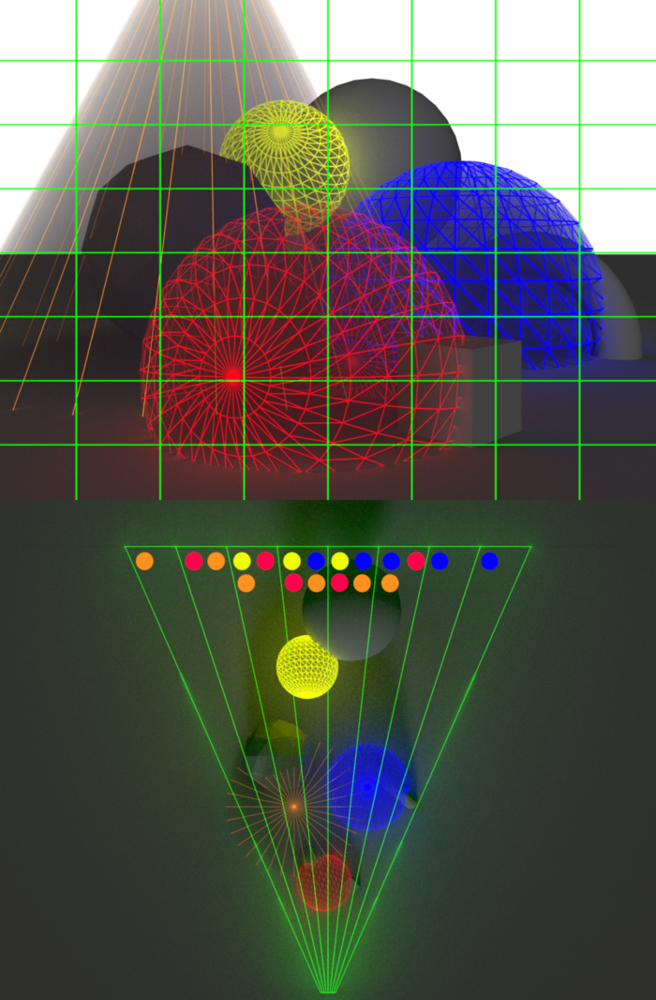

For the past 2 months I have been working on a Clustered Renderer for the PlayStation 5 with the aim to learn more about rendering techinques and PlayStation's AGC API. Throughout this blog post I will share my findings about my research and implementation of the Clustered Shading algorithm. Unfortuantely I can't share the source code of my project because AGC is a closed source API under an NDA. Even though that's the case, I will share some pseudo code relevant to the subject. So let's get to it!

## Table of contents
1. [Theory](#theory)
    1. [What is Clustered Shading?](#theory1)
    2. [Comparing rendering algorithms](#theory2)
2. [Implementation](#implementation)
    1. [Building clusters](#implementation1)
    2. [Culling clusters](#implementation2)
    2. [Compacting clusters](#implementation3)
    4. [Light assignment](#implementation4)
3. [Conclusion](#conclusion)
    1. [Further reading](#conclusion1)
    2. [Credits](#conclusion2)

## Theory 

*Rendering thousands of dynamic lights in real-time... Optimizizing as much as possible... Squeezing as much performance as possible from the hardware...*

The Real-Time rendering field has been striving to improve image quality for decades. Modern rendering engines are capable of rendering beautiful scenes. One reason for that is the increase of computational power of our hardware. But without software optimization it wouldn't be possible to render such images quickly.

There are countless of optimizations one could implement. However now we will be focusing on optimization techniques that lower the number of lighting computation during shading. There are a few notable techniques that have been used in Real-Time renderers and had dramatic impact on performance optimization. We will be closely looking at one of them, clustered shading.

### What is Clustered Shading? 

The Clustered Shading algorithm is based off of [1] [Tiled Shading, researched by Ola Olsson and Ulf Assarsson](https://www.cse.chalmers.se/~uffe/tiled_shading_preprint.pdf). The Tiled Shading algorithm efficiently culls lights for both forward and deffered systems. The idea is that we subdivide the screen into tiles and build a buffer which keeps track of what lights affects the geometry within a given tile. During the shading pass we compute only the lights within the current tile. This significantly reduces the number of lights that we need to compute for. [3] [Ángel Ortiz, who also made a blog post about clustered shading, created great visualizations for Tiled and Clustered Shading, which I have used. Check out his blog post as well!](https://www.aortiz.me/2018/12/21/CG.html) Here is a visualization of assigning lights into tiles:

// TODO: Point out issues with Tiled Shading

In [2] [*Clustered Shading (*Ola Olsson, Markus Billeter and Ulf Assasson, Clustered Deferred and Forward Shading, 2012*)*](https://www.cse.chalmers.se/~uffe/clustered_shading_preprint.pdf) we take things further and also subdivide the screen into the 3rd dimension, using 3D cells, also known as clusters. This is an obvious next step based on the issues pointed out before. Here is a visualization of assigning lights into said clusters from a top-down view:

TODO...

### Comparing rendering algorithms 
...

## Implementation 
...

### Building clusters 
...

### Culling clusters 
...

### Compacting clusters 
...

### Light assignment 
...

## Conclusion 
...

### Further reading 
...

### Credits 

- [1] [*Ola Olsson and Ulf Assarsson. Tiled Shading, 2011*](https://www.cse.chalmers.se/~uffe/tiled_shading_preprint.pdf)
- [2] [*Ola Olsson, Markus Billeter and Ulf Assasson, Clustered Deferred and Forward Shading, 2012*](https://www.cse.chalmers.se/~uffe/clustered_shading_preprint.pdf)
- [3] [Ángel Ortiz, A Primer On Efficient Rendering Algorithms & Clustered Shading, 2018](https://www.aortiz.me/2018/12/21/CG.html)