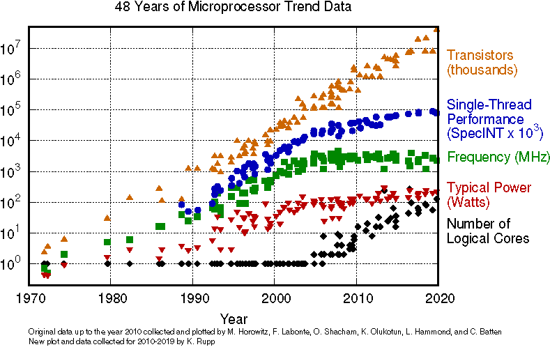
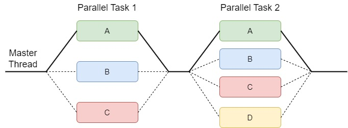
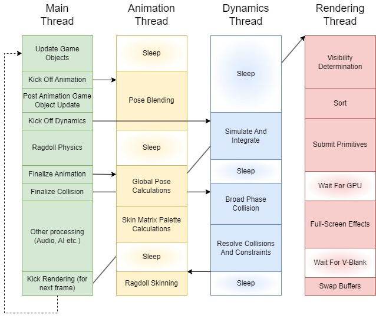

...

## Table of contents
1. [Theory](#theory)
    1. [A brief background of multi-processing](#theory1)
    2. [Multi-threading game loops](#theory2)
    3. [Fibers... What are they?](#theory3)
2. [Implementation](#implementation)
    1. [Using Fibers](#implementation1)
3. [Conclusion](#conclusion)
    1. [Further reading](#conclusion1)
    2. [Sources](#conclusion2)

## Theory 

Nowadays commercial game-engines heavily use multi-threading to support playable frame rates. There are many different approaches for integrating multi-threading into an application, and in this section we will explore the different approaches used over the years.

### A brief background of multi-processing 

The processor manufacturing industry in 2004 encountered a problem with heat dissipation, which prevented them from producing faster CPUs. In turn, the multi-processor manufacturers shifted their focus to producing multi-processor CPUs. This switch had effect on the Moore's Law, which predicts an approximate doubling in transistor counts every 18 to 24 months. And that statement still holds true today. But in 2004, its assumed correlation with with doubling processor speeds was shown to be no longer valid, as single threaded performance advencements started to dissipate.

<figure align="center" class="image">

<figcaption> <a href="https://www.semianalysis.com/p/a-century-of-moores-law"> Transistor count over the years. Douglas Herz. A Century of Moore’s Law, Febrary 04, 2023 </a> </figcaption>
</figure>

As a result of this switch to multi-core systems, the game engines at the time turned to parallel processing techniques. This can be seen with systems such as the Xbox 360 and PlayStation 3, where the game engines no longer relied on a single main game loop to service their subsystems. Designing multi-threaded programs is much harder than single-threaded ones. Most game companies took a few years to switch their game engines to completely utilize multi-threading. They transformed the engines step by step, where they selected subsystems and parallelized them. By 2008, most commercial game engines had completed their turn to multi-processing, with different approaches and varying degrees of parallelism.

### Multi-threading game loops 

...

#### Fork And Join

One of utilizing the multi-core hardware is to use the so called divide-and-conquer algorithms, often called fork and join. 
The idea here is to divide the work into smaller chunks, distribute these onto the hardwares cores (fork), and merge the results once all of the smeller work chunks have been completed (join). In practice this looks similar to a single-threaded approach, but with some major parts being parallelized. Let's take a look at a visual example.

<figure align="center" class="image">

<figcaption> Join and Fork architecture </figcaption>
</figure>

We can see that the master thread forks the task into 3 processes, 2 of them being other threads. And later on the processes join and the master thread again forks into 4 tasks until they are completed and joins again. In this case the master thread is doing a part of the work we want to do, but it is also possible to let the entirety of the work to be done by other threads and let the master thread do some other work in the mean time, for example preparing for or even doing the next fork. Also notice how I have named the thread that is dividing up the work "master thread", this is because the forking doesn't have to be done by the main thread of the program and multiple forks can be done one after the other to later be joined together.

#### One Thread Per Subsystem

Another famous approach to multitasking is to assign engine subsystems to their own cores. The main thread controls and synchronizes the operations of these major subsystems threads and also continues to handle a share of the engines high level-logic. On hardware with multiple physical CPUs or cores, this approach allows these subsystems to execute in parallel. This design is well suited for subsystems that do relatively isolated work, for example the renderer or the audio engine. We can depict such an architecture with the following diagram.

<figure align="center" class="image">

<figcaption> One thread per subsystem architecture </figcaption>
</figure>

#### Jobs

....

### Fibers... What are they? 

...

## Implementation 

...

### Using Fibers 

...

## Conclusion 

...

### Further reading 

...

### Sources 

- [1] [*Douglas Herz. A Century of Moore’s Law, Febrary 04, 2023*](https://www.semianalysis.com/p/a-century-of-moores-law)
- [2] [*Jason Gregory. Game Engine Archiechure 3th edition, August 17, 2018*](https://www.gameenginebook.com)

---
*If you see this, I would like to thank you for keeping with my blog post until the end. You can find more of my blog posts at the [main page](https://mmzala.github.io/blog/). Feel free to reach out through my e-mail (marcinzal24@gmail.com) with any questions or comments. You can also find me on [LinkedIn](https://www.linkedin.com/in/marcin-zalewski-6a17231a4/) if you would rather reach out to me that way.*