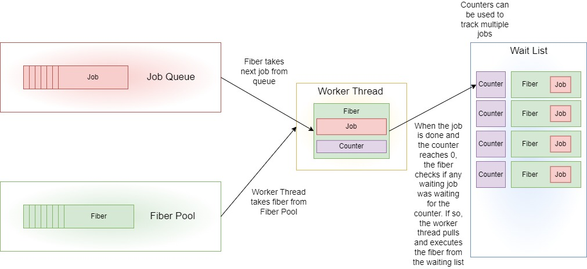

For a while now I have been interested in multi-threading, and when I discovered fibers, I got the last push I needed to start my experience with it. During my self-study time at [Breda University of Applied Sciences](https://www.buas.nl), for the last 2 months, I have been learning about multi-threading. Throughout this blog post I'll be sharing my findings about multi-processing and implementing a fiber based job system.

## Table of contents
1. [Theory](#theory)
    1. [A brief background of multi-processing](#theory1)
    2. [Multi-threading game loops](#theory2)
    3. [Fibers... What are they?](#theory3)
2. [Implementation](#implementation)
    1. [Designing a fiber based job system](#implementation1)
    2. [Using Fibers](#implementation2)
    3. [Initializing the job system](#implementation3)
    4. [Running Jobs](#implementation4)
    5. [Waiting for jobs](#implementation5)
    6. [Atomic locks](#implementation6)
3. [Conclusion](#conclusion)
    1. [Further reading](#conclusion1)
    2. [Sources](#conclusion2)

## Theory <a name="theory"></a>

Nowadays commercial game-engines heavily use multi-threading to support playable frame rates. There are many different approaches for integrating multi-threading into an application, and in this section we will explore the different approaches used over the years.

### A brief background of multi-processing <a name="theory1"></a>

The processor manufacturing industry in 2004 encountered a problem with heat dissipation, which prevented them from producing faster CPUs. In turn, the multi-processor manufacturers shifted their focus to producing multi-processor CPUs. This switch had effect on the Moore's Law, which predicts an approximate doubling in transistor counts every 18 to 24 months. And that statement still holds true today. But in 2004, its assumed correlation with with doubling processor speeds was shown to be no longer valid, as single threaded performance advancements started to dissipate.

<figure align="center" class="image">

<figcaption> <a href="https://www.semianalysis.com/p/a-century-of-moores-law"> Transistor count over the years. Douglas Herz. A Century of Moore’s Law, February 04, 2023 </a> </figcaption>
</figure>

As a result of this switch to multi-core systems, the game engines at the time turned to parallel processing techniques. This can be seen with systems such as the Xbox 360 and PlayStation 3, where the game engines no longer relied on a single main game loop to service their subsystems. Designing multi-threaded programs is much harder than single-threaded ones. Most game companies took a few years to switch their game engines to completely utilize multi-threading. They transformed the engines step by step, where they selected subsystems and parallelized them. By 2008, most commercial game engines had completed their turn to multi-processing, with different approaches and varying degrees of parallelism.

### Multi-threading game loops <a name="theory2"></a>

Commercial game engines have opted for different patterns when implementing multi-threading into their applications. We will take a look at the 3 most popular approaches used.

#### Fork And Join

One way of utilizing the multi-core hardware is to use the so called divide-and-conquer algorithms, often called fork and join. 
The idea here is to divide the work into smaller chunks, distribute these onto the hardwares cores (fork), and merge the results once all of the smeller work chunks have been completed (join). In practice this looks similar to a single-threaded approach, but with some major parts being parallelized. Let's take a look at a visual example.

<figure align="center" class="image">

<figcaption> Join and Fork architecture </figcaption>
</figure>

We can see that the master thread forks the task into 3 processes, 2 of them being other threads. And later on the processes join and the master thread again forks into 4 tasks until they are completed and joins again. In this case the master thread is doing a part of the work we want to do, but it is also possible to let the entirety of the work to be done by other threads and let the master thread do some other work in the mean time, for example preparing for or even doing the next fork. Also notice how I have named the thread that is dividing up the work "master thread", this is because the forking doesn't have to be done by the main thread of the program and multiple forks can be done one after the other to later be joined together.

#### One Thread Per Subsystem

Another famous approach to multitasking is to assign engine subsystems to their own cores. The main thread controls and synchronizes the operations of these major subsystems threads and also continues to handle a share of the engines high level-logic. On hardware with multiple physical CPUs or cores, this approach allows these subsystems to execute in parallel. This design is well suited for subsystems that do relatively isolated work, for example the renderer or the audio engine. We can depict such an architecture with the following diagram.

<figure align="center" class="image">

<figcaption> One thread per subsystem architecture </figcaption>
</figure>

One problem with this approach is that each thread represents their own course-grained chunk of work, for example all physics calculations. This puts a restriction on how the various cores can be utilized. If one of the subsystems has not completed its work, the progress of other threads may be blocked. Or if one subsystem has no work to do at the moment, and just sleeps, it doesn't utilize its thread to the fullest and could run other calculations in the background, such as the beginning of the Dynamics Thread seen in the diagram above.

#### Jobs

A different way to take advantage of multi-core hardware is to divide up work in small, relatively independent tasks (jobs). A job can be thought of as simply just a pairing of data and a function that operates on that data. When a job is created, it is placed in a queue, waiting until the next available thread can pick it up and run it.

<figure align="center" class="image">

<figcaption> Jobs architecture </figcaption>
</figure>

The fact that jobs are small and independent of one another helps to maximize processor utilization, while providing more flexibility. It relieves some restrictions that would come with the "one thread per subsystem" approach. For example, this design nicely scales up with the amount of cores present, where you can just offload work to more threads. In this blog post we well dive deeper into and implement this design.

### Fibers... What are they? <a name="theory3"></a>

Before we get to the actual implementation, we have to talk about fibers. You can think about fibers like a partial thread, which contains a user provided stack space, small context state of the fiber and saved registers. However, fibers are executed by a thread. This happens by taking a normal thread and swapping the registers and the stack pointer, also called "switching a fiber". We also have the difference between cooperative multi-threading, which leaves the control of scheduling to the developer, and preemptive multi-threading, which gives the control of scheduling to the OS. Fibers also have a nice benefit here, as fibers are cooperative multi-threading, that means that a fiber can never be preempted, because the user has control over switching fibers on a thread, by explicitly calling a function to switch fibers. Because switching fibers is just swapping out the registers and the stack pointer, it has minimal overhead, because there is no thread context switching between fibers. Only saving/restoring registers. To make it more clear, let's take a look at a diagram, which shows how fibers fit in a program.

<figure align="center" class="image">

<figcaption> How fibers fit in a program </figcaption>
</figure>

As seen from the diagram, user's logic can be run either on a regular thread or a fiber, which itself runs on a thread. As explained before, the developer has control over scheduling fibers, the OS will not help with this. Also the user can create a lot more fibers than threads, as things like stack memory allocation are a lot more controllable by developers. Since we save the registers in a fiber, we can stop the execution of a function in the middle, to run a more important function, and resume the waiting fiber later on when needed. Though not shown in the diagram, a system that uses fibers commonly use thread affinity to lock threads to dedicated cores to avoid potential context switching and in turn, better performance. The number of background threads doesn't need to be high, commonly only a few low priority threads are needed for blocking operations like IO.

There are more things to explore, which we will take a look at with more detail while implementing our job system.

## Implementation <a name="implementation"></a>

While there are many different ways to implement a job system, we'll be focusing on implementing a system inspired by the [Naughty Dogs fiber based job system](https://www.youtube.com/watch?v=HIVBhKj7gQU&t=1399s). If you want to take a closer look at the details while following implementation side of the blog post or simply look at it later, my implementation is open source and can be found on GitHub: [Fiber based job system repository.](https://github.com/mmzala/fiber-job-system)

 First let's talk about the design on the system we want to implement.

### Designing a fiber based job system <a name="implementation1"></a>

#### The user side

The job system will have a simple API, where the user will create the job system and will be able to use it in the following way:

```cpp
// Create the job definitions
const uint32_t numJobs = 100;
JobDecl jobs[numJobs];

// Fill them in using the entry point and parameter
for (int i = 0; i < numJobs; ++i)
{
    jobs[i] = JobDecl(function, params);
}

// Schedule all jobs and create a counter that you can wait for
Counter counter{};
jobSystem.RunJobs(jobs, numJobs, &counter);

// Wait for all jobs by waiting for the counter to be zero
jobSystem.WaitForCounter(&counter);
```

The user makes job declarations using a function pointer and any parameters the function takes. The user then creates a counter and runs the jobs. The counter, which is just an atomic integer, is used to synchronize our program when calling `WaitForCounter()`. Now that we have an idea how the user side of the code looks like, let's take a look at the inside.

#### The implementation side

We'll spawn a specified amount of threads and lock them with affinity to a given core. This tells the OS's scheduler where exactly our threads want to run. The threads will be the execution units, which will run fibers. And each fiber runs it's own job, which the fiber will pull from a queue of jobs that have been added using the above mentioned `RunJobs` call.

But how is that any different from using a job system that solely uses threads to run jobs? To leverage the functionality of the fiber possessing their own stack memory, we are able to create jobs inside other jobs, which gives us the freedom to jobify our program heavily in an easy way by chaining jobs one after the other inside each other. To achieve this, the job system will make use of a wait list, where all the waiting jobs associated with a counter will be inserted. This happens when the user calls `WaitForCounter()`, this call means that the user wants to make sure the jobs requested to be run are complete. That means the current executing fiber will be put into the wait list, and a new fiber will be used to run the next jobs in the queue. When the job completes the counter decrements and when it reaches zero, all the jobs are done associated with the counter and we can return to the previous fiber waiting in the wait list to continue the functions execution where the `WaitForCounter()` call was made. I help explain this concept, let's take a look at a diagram.

<figure align="center" class="image">

<figcaption> Job system using the wait list to execute job dependencies </figcaption>
</figure>

### Using Fibers <a name="implementation2"></a>

Now that we have an overview of what we need to create our job system, let's take a look at actually using fibers in code. Thankfully Windows provides a really simple API for us, which becomes available with the `windows.h` header.

```cpp
#include <windows.h>


void FiberWorkEntry(void* parentFiber)
{
    printf("Executing fiber.\n");

    // We save the registers to save our state and switch back
    SwitchToFiber(parentFiber);

    printf("Finished executing fiber.\n");
}

void Main()
{
    uint32_t fiberStackSize = 1024;

    // Convert current thread to fiber
    void* threadFiber = ConvertThreadToFiber(nullptr);

    // Create fiber to run
    void* fiber1 = CreateFiber(fiberStackSize, FiberWorkEntry, threadFiber);

    // Switch to fiber that executes `FirstFiberWorkEntry` function
    SwitchToFiber(fiber1);

    printf("Back to thread fiber.\n");

    // Switch back to fiber1 again to execute the last part of the function
    SwitchToFiber(fiber1);

    printf("Finished work.\n");

    // Clean up fibers
    DeleteFiber(fiber1);
    ConvertFiberToThread();
}
```

The program above will five us the following output:

```
Executing fiber.
Back to thread fiber.
Finished executing fiber.
Finished work.
```

Only fibers can yield to fibers, but when the program starts up, there are no fibers. So the thread must first convert itself into a fiber using `ConvertThreadToFiber()`, which returns the fiber object that represents itself. It takes one argument analogous to the last argument of `CreateFiber()`, except that there’s no entry point and parameters to accept. The process is reversed with `ConvertFiberToThread()`.

The `SwitchToFiber()` function is when the state of execution is saved into the fiber for later resumption. After it is saved, the switch to the other fiber actually happens. When we switch back to a fiber with the saved state, it resumes execution from the the next line after `SwitchToFiber()`. This switching of fibers allows us to chain fiber switching together with as many fibers as we want.

### Initializing the job system <a name="implementation3"></a>

Now that we have basic understanding of how to implement fibers, we can start using them to create a job system.

```cpp
JobSystem::JobSystem(const Args& args)
	:
	mThreads(args.mNumThreads),
	mFiberPool(args.mNumFibers),
	mJobQueue(args.mQueueSize)
{
	for (int i = 0; i < mThreads.size(); ++i)
	{
		mThreads[i] = std::thread(ThreadWorkerEntry, this);

		// Set affinity
		HANDLE handle = reinterpret_cast<HANDLE>(mThreads[i].native_handle());
		DWORD_PTR affinityMask = DWORD_PTR(1) << i;
		DWORD_PTR result = SetThreadAffinityMask(handle, affinityMask);
		assert(result != 0 && "Failed while setting thread affinity");
	}

	for (int i = 0; i < mFiberPool.Capacity(); ++i)
	{
		mFiberPool.PushBack(CreateFiber(args.mFiberStackSize, FiberWorkerEntry, this));
	}
}
```

We first create all the threads that will run the fibers and set their affinity to their own dedicated cores. We then create all of the fibers that will run the jobs. To store the fibers I use a custom thread safe ring buffer, which makes it easier for me to pop and push fibers when needed across different threads.

### Running Jobs <a name="implementation4"></a>

The user requests the jobs to by run using the `RunJobs()` function. This function pushes the job into an atomic ring buffer.

```cpp
void JobSystem::RunJobs(JobDecl* jobs, uint32_t numOfJobs, Counter* counter)
{
	assert(jobs != nullptr && "Jobs always has to be present when running jobs... duh...");
	assert(counter != nullptr && "Counter always has to be present when running jobs");

	*counter = numOfJobs;

	for (uint32_t i = 0; i < numOfJobs; ++i)
	{
		jobs[i].mCounter = counter;
		mJobQueue.PushBack(jobs[i]);
	}
}
```

This job is then picked up by a fiber on a thread. When a thread is spawned during the initialization, it start executing the `ThreadWorkerEntry()` function, which converts the thread into a fiber. Because the thread now acts like a fiber, we can start running the same logic as for other worker fibers created using `FiberWorkerEntry()`. That is the same function that every fiber will execute when switched to from the fiber pool.

```cpp
void JobSystem::FiberWorkerEntry(void* userData)
{
	JobSystem& jobSystem = *reinterpret_cast<JobSystem*>(userData);

	while (!jobSystem.IsShuttingDown())
	{
		if (tFiberToBeUnlockedAfterSwitch != nullptr)
		{
			tFiberToBeUnlockedAfterSwitch->lock.Unlock();
			tFiberToBeUnlockedAfterSwitch = nullptr;
		}

		std::optional<JobDecl> job = jobSystem.mJobQueue.PopFront();

		if (job.has_value())
		{
			FiberJobEntry(job.value(), jobSystem);
		}
		else
		{
			_mm_pause();
		}
	}
}
```

We run this function until the job system is requested to shut down. We also define a `thread_local` variable, which tells the fiber to unlock it's atomic lock after switching to another fiber. We will talk in more detail about it when discussing waiting for counters. If a job is found, we execute it, otherwise we use the `_mm_pause()` instruction, which tells the processor that the calling thread is in a "spin-wait" loop. This will pause the next instruction from executing and in so doing the processor is not under demand and parts of the pipeline will not be used, thus saving power.

The `FiberJobEntry` executes the job, decrements the counter and checks if a job that waits on the counter can be resumed, using the wait list.

```cpp
void JobSystem::FiberJobEntry(JobDecl job, JobSystem& system)
{
	job.mFunction(job.mParam);
	Counter* counter = job.mCounter;

	(*counter)--;

	if (*counter == 0)
	{
		system.mWaitListLock.Lock();
		auto itr = system.mWaitList.find(counter);

		// If counter is decremented before JobSystem::WaitForCounter() adds fiber to wait list,
		// or after fiber was added to wait list, but also after the WaitForCounter() noticed, 
		// that counter is 0 and already removed itself from wait list. 
		// This situation is going to be detected in fiber that called JobSystem::WaitForCounter(),
		// so here, we just release mWaitListLock.
		if (itr == system.mWaitList.end())
		{
			system.mWaitListLock.Unlock();
			return;
		}

		UsedFiber* awaitingFiber = itr->second;
		assert(awaitingFiber->fiber != nullptr);
		system.mWaitList.erase(counter);
		system.mWaitListLock.Unlock(); // We have to release it before we try to obtain the lock on fiber in order to avoid deadlock

		// When we call RunJobs and then WaitForCounter somewhere else, 
		// awaiting fiber (added to wait list) could have still not switched to
		// another fiber from pool, so we spin until that happens
		awaitingFiber->lock.Lock();
		// And immediately unlock, because awaitingFiber is now truly awaiting and it was the only purpose of this lock
		awaitingFiber->lock.Unlock();

		// Save current fiber to be added to fiber pool after switch is done
		tFiberToBeAddedToPool = tCurrentFiber;
		tCurrentFiber = awaitingFiber->fiber;
		// Switch to fiber pulled from wait list
		SwitchToFiber(awaitingFiber->fiber);

		// We push previous fiber to fiber pool only if we were on wait list and we came back from it.
		// Here, we weren't, so we are back again only because someone else got pushed to wait list,
		// so we can't add him to the pool, so tFiberToBeAddedToPool has to be nullptr
		assert(tFiberToBeAddedToPool == nullptr);
		assert(tCurrentFiber != nullptr);
	}
}
```

We first execute the actual function and decrement it's associated counter. If the counter is 0, we know that we can check the wait list for any jobs that depend on that counter and can be resumed. The wait list is just an `std::unordered_map` with the counter pointer as the key and the fiber as the value. We also save the current fiber to later push it back into the available fiber ring buffer. There are a couple atomic locks placed in this function as well, which I hope become clear after we discuss the `WaitForCounter` function, which we will do in the next section.

### Waiting for jobs <a name="implementation5"></a>

Our last piece of the puzzle is waiting for the counter after queuing jobs we want to run. This happens in the `WaitForCounter` function.

```cpp
void JobSystem::WaitForCounter(Counter* counter)
{
	assert(counter != nullptr && "Counter always has to be present when waiting for it...");

	UsedFiber usedFiber{ tCurrentFiber };
	usedFiber.lock.Lock();

	// Add itself to the wait list
	assert(tCurrentFiber != nullptr);
	mWaitListLock.Lock();
	mWaitList[counter] = &usedFiber;
	mWaitListLock.Unlock();

	if (*counter == 0)
	{
		std::lock_guard<SpinLock> guard(mWaitListLock);

		// We are here in one of 2 scenarios:
		// 1. Jobs was completed before we added ourselves to wait list, or jobs were completed after we added ourselves to wait list, 
		// but last job didn't take a mWaitListLock before us, so we just remove ourselves from wait list and continue execution.
		// 2. Jobs were completed after we added ourselves to wait list and last job took mWaitListLock before us removed us from wait list,
		// and now it's spinning on StatefullFiber::m_lock, that means we have to switch to a free fiber, 
		// so we go to another fiber and then releasing fiber lock as fast as possible.

		auto itr = mWaitList.find(counter);

		if (itr != mWaitList.end())
		{
			// 1. Jobs were already completed, we remove ourselves from wait list and continue execution
			mWaitList.erase(counter);
			return;
		}

		// 2. Counter not equal to 0 has the same logic
	}

	std::optional<FiberHandle> workerFiber = mFiberPool.PopFront();
	assert(workerFiber.has_value() && "No more fibers available!");
	tCurrentFiber = workerFiber.value();

	// Fiber we switch to will unlock the lock on UsedFiber in FiberWorkerEntry
	tFiberToBeUnlockedAfterSwitch = &usedFiber;

	SwitchToFiber(workerFiber.value());

	// Fiber is done with work, so we are back, now add fiber that we switched from to fiber pool, set it to nullptr afterwards.
	// tFiberToBeUnlockedAfterSwitch cannot be null, because we can get here only when someone pulled us
	// from wait list and then switched to us, so we have to add previous fiber to the fiber pool.
	assert(tCurrentFiber != nullptr);
	assert(tFiberToBeAddedToPool != nullptr);
	mFiberPool.PushBack(tFiberToBeAddedToPool);
	tFiberToBeAddedToPool = nullptr;
}
```

To make use of the wait list we create a `UsedFiber` object, which is just a pair of a fiber and a atomic lock. The atomic lock is used to signal inside the `FiberJobEntry` that we switched to another fiber from the fiber pool. After, we add the currently used fiber to the wait list and pull a new fiber to switch to, which will run the `FiberJobEntry` function, to run the next job in the queue. After we switch back to this fiber, we will no longer use it, so we add it back to the pool of available fibers. 

When calling `WaitForCounter()`, there is a chance the jobs associated with the counter have already completed their work and were not removed from the wait list. In that case we can just remove it from the wait list and continue with the current fiber that is being executed.

### Atomic locks <a name="implementation6"></a>

While I have explained the main points of how the fiber based job system works and you can skip this part if you don't feel like reading through some theory again. There is still one topic I would like to touch upon, which was used throughout this blog post and is important part of the performance that the job system has, namely, atomic locks.

When you see a `.Lock()` function call in the code, it is a spinlock, which is implemented using a atomic boolean and the `_mm_pause()` instruction mentioned before during the `Running Jobs` section.

```cpp
class SpinLock
{
public:
	void Lock() 
	{
		while (true) 
		{
			while (mLock)
			{
				_mm_pause();
			}

			if (!mLock.exchange(true))
			{
				break;
			}
		}
	}

	void Unlock() 
	{
		mLock.store(false);
	}

private:
	std::atomic<bool> mLock = false;
};
```

I have used spinlocks instead of just mutexes for a few reasons.

#### The difference between mutex and spinlock

When a thread tries to lock a mutex and it does not succeed, because the mutex is already locked, it will go to sleep, immediately allowing another thread to run. It will continue to sleep until being woken up, which will be the case once the mutex is being unlocked by whatever thread was holding the lock before. When a thread tries to lock a spinlock and it does not succeed, it will continuously retry locking it, until it finally succeeds, thus it will not allow another thread to take its place (however, the OS will forcefully switch to another thread, once the CPU runtime quantum of the current thread has been exceeded).

#### The problem of the mutex

When mutexes are putting threads to sleep and waking them up again, need quite a lot of CPU instructions and thus also take some time. If now the mutex was only locked for a very short amount of time, the time spent in putting a thread to sleep and waking it up again might exceed the time the thread has actually slept by far and it might even exceed the time the thread would have wasted by constantly polling on a spinlock. On the other hand, polling on a spinlock will constantly waste CPU time and if the lock is held for a longer amount of time, this will waste a lot more CPU time and it would have been much better if the thread was sleeping instead.

#### So... When to use spinlocks?

With plenty of locks that are held for a very short amount of time, the time wasted for constantly putting threads to sleep and waking them up again might decrease runtime performance noticeably. When using spinlocks instead, threads get the chance to take advantage of their full runtime quantum (always only blocking for a very short time period, but then immediately continue their work), leading to much higher processing throughput.

While I have noticed that spinlocks improved the performance of my job system, I didn't have enough time to thoroughly test in every use-case, so there is definitely more to explore for me regarding this.

## Conclusion <a name="conclusion"></a>

Now that we are at the end, I hope you have learned at least a few new things from this blog post. While this is my first ever job system I have made and it's definitely not perfect, I learned a lot throughout my journey while implementing it and writing this blog post. And there is a lot more knowledge and experience left to be acquired when it comes to multi-threading, and this post scratched only the surface of what's possible.

### Further reading <a name="conclusion1"></a>

If you're interested in more, I'll leave a few links where you can further expand your knowledge of this topic. You can also look at the sources I have used, which explain some points in more detail.

Jiayin Cao, a senior graphics programmer at NVIDIA, went into more detail how fibers work under the hood and how to implement them from scratch. It's worth a read if you're interested in low-level programming:

[Fiber in C++: Understanding the Basics](https://agraphicsguynotes.com/posts/fiber_in_cpp_understanding_the_basics/)

If you want to know more about writing elegant multithreaded applications in C++, I would definitely recommend the C++ Concurrency in Action book written by Anthony Williams. It includes explanations about synchronization, designing concurrent code and even debugging multi-threaded application, which I haven't even touched upon in this blog post:

[C++ Concurrency in Action, Second Edition](https://www.amazon.nl/-/en/Anthony-Williams/dp/1617294691)

One more point I have not touched upon in this blog post regarding job systems is job stealing. Job stealing algorithm is a scheduling technique that allows a worker thread to steal subtasks from other workers when it has nothing to do. Manu Sanchez has written a blog post explaining exactly that:

[Lock-free job stealing with modern C++](https://manu343726.github.io/2017-03-13-lock-free-job-stealing-task-system-with-modern-c/)

### Sources <a name="conclusion2"></a>

- [1] [*Douglas Herz. A Century of Moore’s Law, Febrary 04, 2023*](https://www.semianalysis.com/p/a-century-of-moores-law)
- [2] [*Jason Gregory. Game Engine Archiechure 3th edition, August 17, 2018*](https://www.gameenginebook.com)
- [3] [*Christian Gyrling. Parallelizing the Naughty Dog Engine Using Fibers, March 2-6, 2015*](https://www.youtube.com/watch?v=HIVBhKj7gQU&t=1399s)
- [4] [*Chris Wellons. Fibers: the Most Elegant Windows API, March 28, 2019*](https://nullprogram.com/blog/2019/03/28/)
- [5] [*Intel.com. Architecture Agnostic Spin-Wait Loops, April 26, 2018*](https://www.intel.com/content/www/us/en/developer/articles/technical/a-common-construct-to-avoid-the-contention-of-threads-architecture-agnostic-spin-wait-loops.html#:~:text=The%20_mm_pause%20instruction%20is%20used,in%20a%20spin-wait%20loop)
- [6] [*Jiayin Cao. Fiber in C++: Understanding the Basics, August 26, 2023*](https://agraphicsguynotes.com/posts/fiber_in_cpp_understanding_the_basics/)

---
*If you see this, I would like to thank you for keeping with my blog post until the end. You can find more of my blog posts at the [main page](https://mmzala.github.io/blog/). Feel free to reach out through my e-mail (marcinzal24@gmail.com) with any questions or comments. You can also find me on [LinkedIn](https://www.linkedin.com/in/marcin-zalewski-6a17231a4/) if you would rather reach out to me that way.*